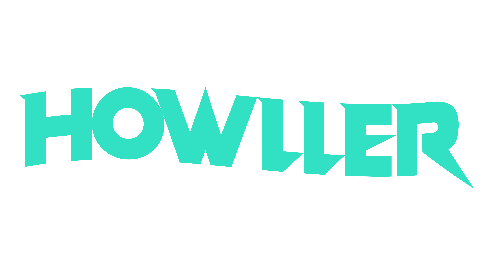
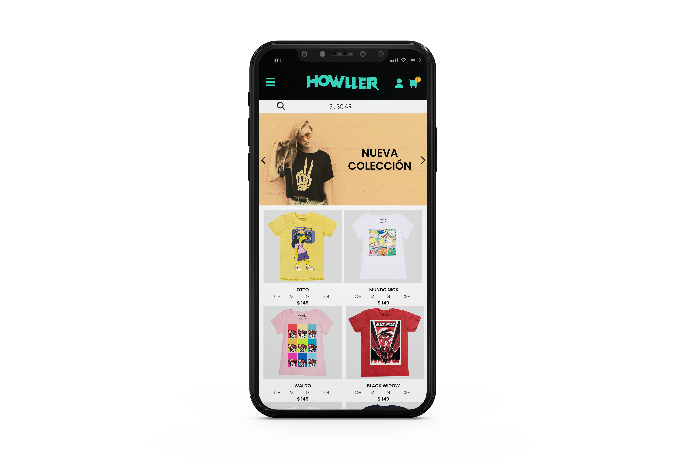
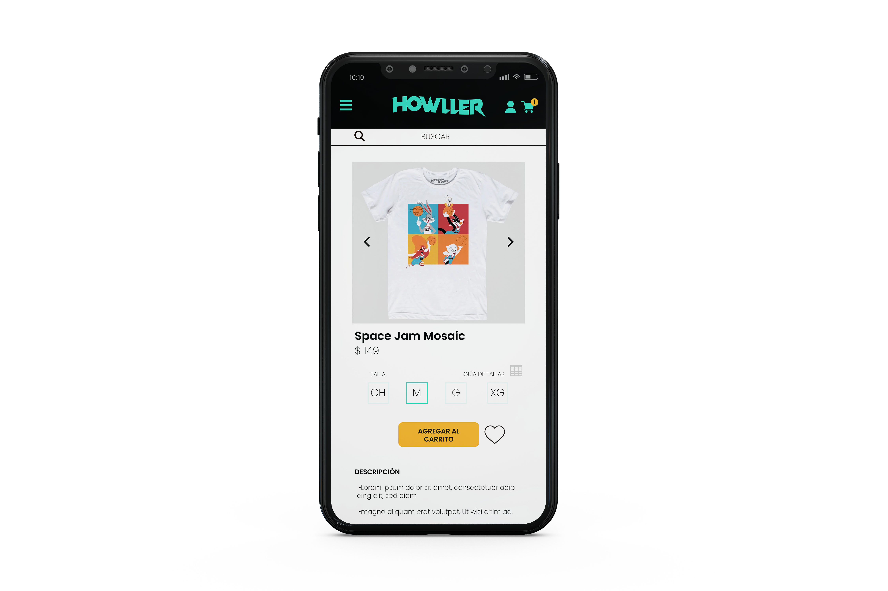
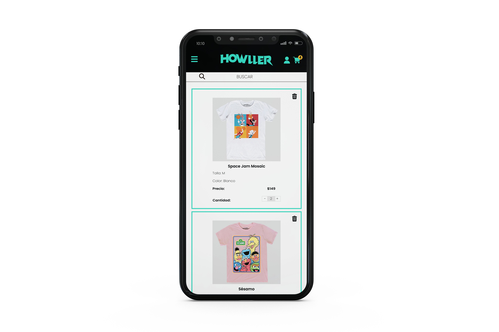
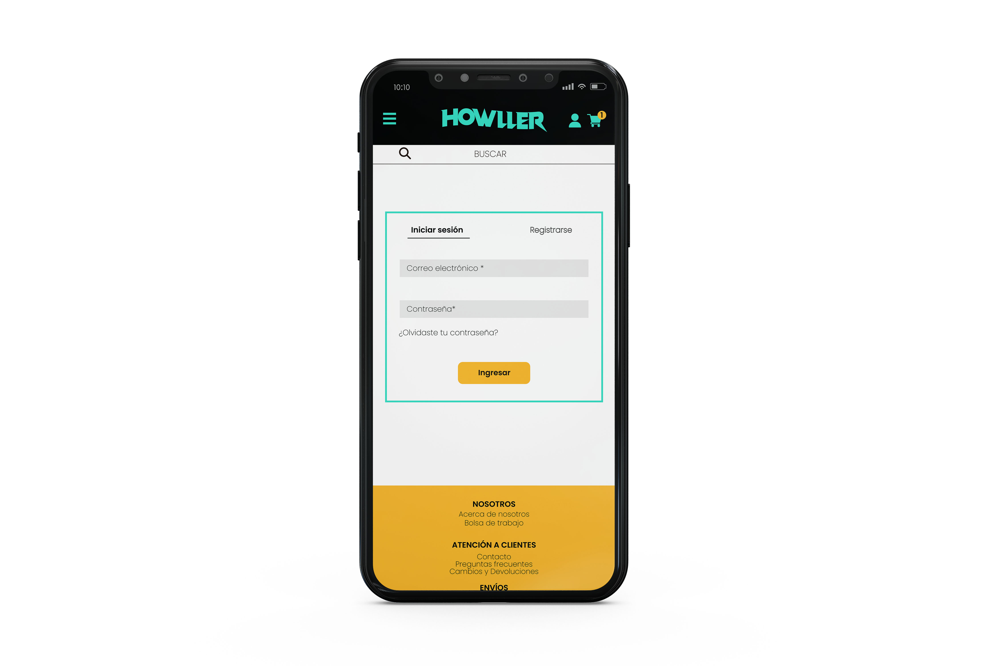
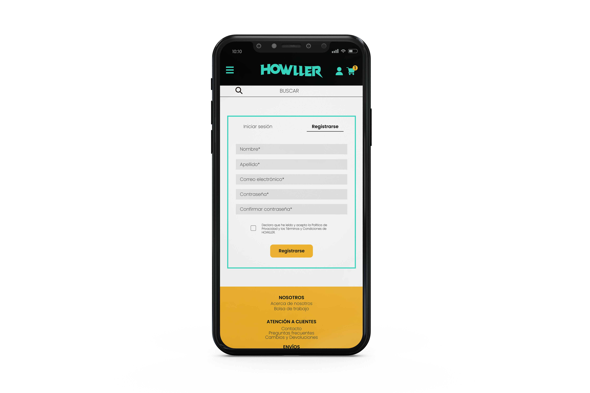

# Howller
## Tienda de camisetas online

**¿Cuál es tu fuente de inspiración?**

Deja que la ropa con estilo propio de Howller le muestre a todo el mundo quién pone las reglas en tu vida: tú. Nuestras colecciones ofrecen diferentes diseños perfectamente adaptados a tus exigencias. Con una playera siempre irás cómodo y con estilo. Nuestras playeras son ideales para ir con estilo, enfocado desde jovenes y hasta chavorrucos.

**Productos que brindará el sitio**

Playeras con estampados de distintas temáticas relacionadas a la cultura popular así como diseños de artistas independientes.

**Audiencia objetivo**

Personas de entre 12 y 35 años con gusto por la ropa casual.

**Oferta hacia ese público**

Venta en línea de playeras con una excelente calidad de tela y estampado que tendrán diseños únicos que involucren tendencias, tanto actuales como pasadas, de la cultura popular tomadas principalmente de películas, series de tv y música. También se sumarán diseños de artistas independientes los cuales serán exclusivos de nuestra marca. 

## Sitios de referencia

- Por su página de inicio:

  https://www.adidas.com/

- Por sus productos y estética:

  https://www.mascaradelatex.com/

- Por su login, registro y carrito:

  https://www.cuidadoconelperro.com.mx/

- Por la página del producto: 

  https://kingmonster.com/

- Por su vista previa del carrito:

  https://toxic.mx/

## Paleta de colores

| Color             | Hex                                                                |
| ----------------- | ------------------------------------------------------------------ |
| principal |  #32E0C4|
| secundario|  #000000|
| terciario |  #FDB827|

## Tipografías

- Poppins
https://fonts.google.com/specimen/Poppins?query=POPPIN

- Source Sans Pro
https://fonts.google.com/specimen/Source+Sans+Pro?query=Source+Sans+Pro

- Alegreya Sans
https://fonts.google.com/specimen/Alegreya+Sans?query=Alegreya+Sans

## Mockups Mobile First

Partiendo de la estrategia de diseño Mobile Fisrt se desarrollaron más a detalle los wireframes para dispositivos móviles de nuestro e-commerce:

Nota:todas las imagenes de las playeras pertenecen a Máscara de Látex y fueron tomadas únicamente con fines didácticos.

## Integrantes del equipo

#### Dario Hinostroza Loera

Ingeniero en sistemas informaticos recien egresado de la Universidad Tecnologica de Nezahualcoyotl, con mucho interes por aprender nuevas tecnologias para seguir mejorando y aprendiendo nuevas habilidades, me gusta el desarrollo web e ir aprendiendo nuevos campos como la Data Science y la IA. 

#### Oscar Baez

Arquitecto egresado de la Facultad de Arquitectura de la UNAM con gusto por el diseño gráfico. Recientemente estoy incursionando en el mundo de la programación y desarrollo web ya que me gustaría dar un giro en mi vida profesional y este es un campo con mucho potencial actualmente y a futuro. 

#### Gregorio Crisanto Gaspar

Ingeniero en sistemas computacionales recien egresado de la Universidad Tecnólogico de Estudios Superiores de Naucalpan, con ganas de aprender desarrollo web, desde la parte del front-end y back-end, me gustaria  aprender de los conociminetos de mis compañeros y viceversa. 

####Link_Trello
https://trello.com/b/HtRX8I2c/sprint2-wireframes
